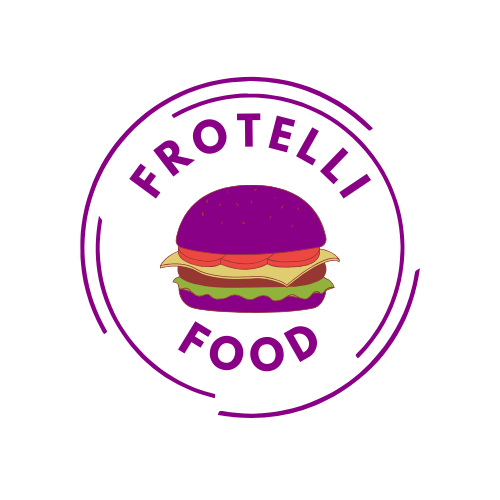

# 🍔 Frotelli Food - Lanchonete Online

Bem-vindo(a) ao **Frotelli Food**, um aplicativo de lanchonete online desenvolvido com **React Native**! 📱

Este projeto simula um sistema de pedidos onde os usuários podem:
- Cadastrar nome e contato 📇
- Visualizar um cardápio completo com lanches, bebidas e combos 🍟🥤
- Adicionar itens ao carrinho 🛒
- Ver o resumo do pedido com total 💰

---

## 🖼️ Interface do App

> A interface foi construída com foco em **facilidade de uso**, cores vibrantes e botões intuitivos para tornar a experiência do cliente rápida e agradável!

---

## 🚀 Tecnologias utilizadas

- [React Native](https://reactnative.dev/)
- [TypeScript](https://www.typescriptlang.org/)
- [React Native Vector Icons (FontAwesome)](https://github.com/oblador/react-native-vector-icons)
- Estilização com `StyleSheet`
- Imagens e assets locais

---